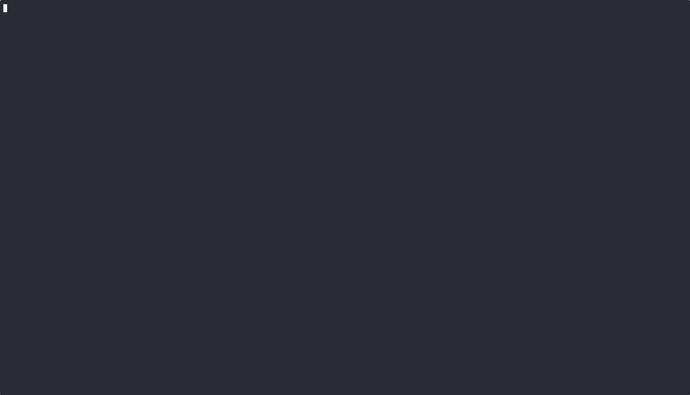

# SecFeed - AI-Powered Security Feed in Real Time


<p align="center">
 <a href="https://golang.org/doc/go1.24" target="_blank">
 </a>
 <a href="https://opensource.org/license/apache-2-0" target="_blank">
 </a>
 <a href="https://github.com/alex-ilgayev/secfeed/actions/workflows/build_and_push.yml"  target="_blank">
 </a>
</p>

SecFeed consolidates cybersecurity news and updates from multiple feeds and then leverages cutting-edge language models to deliver concise, actionable summaries. Whether you're researching new vulnerabilities or staying ahead of the latest threat landscape, SecFeed provides the clarity and insights you need—fast.



## Table of Contents

- [Main Features](#main-features)
- [Installation](#installation)
  - [Prerequisites](#prerequisites)
  - [From Source](#from-source)
  - [Using Docker](#using-docker)
- [Configuration](#configuration)
  - [Configuration File Structure](#configuration-file-structure)
  - [Environment Variables](#environment-variables)
- [Usage](#usage)
  - [Command Line Options](#command-line-options)
  - [Example Configs](#example-configs)
- [Architecture](#architecture)
  - [Flow Diagram](#flow-diagram)
  - [Core Components](#core-components)
- [Cost Management](#cost-management)
- [Contributing](#contributing)
- [Roadmap](#roadmap)
- [License](#license)

## Main Features

- **Intelligent filtering** of security articles using LLM-based categorization
- **Configurable categories** to focus on specific security domains
- Support for **multiple LLM backends** (OpenAI or Ollama)
- **Concise summaries** of relevant security articles
- **Extensible RSS feed system** with built-in content extraction
- **Slack integration** for real-time notifications

## Installation

### Prerequisites

- Go 1.24 or higher
- OpenAI API key or local Ollama setup

### From Source

```bash
# Clone the repository
git clone https://github.com/alex-ilgayev/secfeed.git
cd secfeed

# Build the binary
go build -o secfeed ./cmd/secfeed

# Optional: Install to your $GOPATH/bin
go install ./cmd/secfeed
```

### Using Docker

```bash
# Build the Docker image
docker build -t secfeed .

# Run with Docker
docker run -v $(pwd)/config.yml:/app/config.yml \
-e OPENAI_API_KEY \
-e SLACK_WEBHOOK_URL \
secfeed

# Run with Pre-built Docker Image
docker run -v $(pwd)/config.yml:/app/config.yml \
-e OPENAI_API_KEY \
-e SLACK_WEBHOOK_URL \
alexilgayev/secfeed
```

## Configuration

SecFeed uses a YAML configuration file to define categories for filtering articles and RSS feeds to monitor.

### Configuration File Structure

The basic configuration file and all values are found [here](./config.yml).

```yaml
init_pull: 0
...

reporting:
  slack: false
  ...

llm:
  client: "openai"
  ...

categories:
- name: Software Supply Chain
  description: >
    Articles covering software supply chain security, including best practices,
    tools, processes, and real-world case studies. Content may discuss securing
    dependencies, preventing supply chain attacks, and maintaining the integrity
    of software throughout its lifecycle.
    ...

rss_feed:
- url: https://feeds.feedburner.com/TheHackersNews
  name: The Hacker News
  ...
```

### Environment Variables

- `OPENAI_API_KEY`: Your OpenAI API key. Required when using OpenAI.
- `OLLAMA_BASE_URL`: Base URL for Ollama API. Required when using Ollama. defaults to http://localhost:11434.
- `SLACK_WEBHOOK_URL`: Webhook URL for Slack notifications

## Usage

```bash
secfeed --config config.yml
```

### Command Line Options

```
Usage:
  secfeed [flags]

Flags:
  -c, --config string     config file path (default "config.yml")
  -d, --debug             debug mode (prints extra context with the summarized report)
  -h, --help              help for secfeed
  -l, --log-file string   log file path
  -v, --verbose           verbose output
```

### Example Configs

**Running all articles from the last 7 days**

```yaml
init_pull: 7
```

**Running on OpenAI models**

```yaml
llm:
  client: "openai"
  classification:
    engine: "llm"
    model: "gpt-4o-mini"
    threshold: 8
  summary:
    model: "gpt-4o"
```

**Running on local Ollama models**

```yaml
llm:
  client: "ollama"
  classification:
    engine: "llm"
    model: "llama3.2"
    threshold: 7
  summary:
    model: "llama3.2"
```

**Running classification engine based on text embeddings**

Text embeddings-based classification is still **a work in progress**, and more optimization is needed to make the results more reliable.

```yaml
llm:
  client: "openai"
  classification:
    engine: "embeddings"
    model: "text-embedding-3-large"
    threshold: 4.2
  summary:
    model: "gpt-4o"
```

## Architecture

SecFeed is designed with modularity in mind, separating components into distinct packages:

### Flow Diagram

```

    ┌─────────────┐   ┌────────────────┐   ┌──────────┐
    │ RSS Sources ├──►│ Feed Fetcher   ├──►│ Enricher │
    └─────────────┘   └────────────────┘   └────┬─────┘
                                                │
                                                ▼
     ┌──────────┐       ┌────────────┐     ┌────────────────┐
     │ Slack    │◄──────┤ Summary    │◄────┤ Classification │
     └──────────┘       └──────┬─────┘     └───────┬────────┘
                               │                   │
                               ▼                   ▼
                        ┌───────────────────────────────────┐
                        │ LLM Client (OpenAI / Ollama)      │
                        └───────────────────────────────────┘

```

### Core Components

1. **Feed Fetcher** ([`feed`](./pkg/feed/))

   - Fetches articles from RSS feeds.
   - Provides a stream of articles for processing.
   - This can be extended to include additional sources, such as LinkedIn and Twitter.

2. **Enricher** ([`feed.enrichArticleItem`](./pkg/feed/feed.go))

   - Content is usually missing from RSS feeds.
   - Smartly fetches the content from the blog.
   - Adding browser-like headers to avoid being blocked.
   - Extracts the relevant information from the HTML.
   - Using [go-readability](https://github.com/go-shiori/go-readability) for the text cleaning task.

3. **Classification Engine** ([`classification`](./pkg/classification))

   - Analyzes articles for relevance using LLM or embeddings.
   - Scores articles against user-defined categories.
   - Filters out irrelevant content based on threshold.

4. **LLM Client** ([`llm`](./pkg/llm/))

   - Abstracts interaction with language model providers.
   - Supports OpenAI API and Ollama.
   - Handles prompt engineering, result analysis, and input chunking.
   - Tracking costs only for OpenAI implementations.

5. **Summary Engine** ([`llm.Summarize`](./pkg/llm/client.go))

   - Provides a summary of the article and relevant action items.

6. **Slack** ([`slack`](./pkg/slack/))

   - Articles are formatted for Slack.
   - Sends webhook notifications.

### Classification Engine

There are currently two classification methods that can be configured through the `llm.classification.engine` config value.

1. **LLM Classification**

   - Evaluation of article relevance is based on direct LLM queries. Provide the categories and their descriptions to the prompt, and ask for a relevance score between 0 and 10.
   - Provides detailed explanations for classifications
   - Higher accuracy but more token usage. See cost estimations [here](./README.md#cost-management).

2. **Embeddings Classification**
   - Uses vector embeddings to match articles to categories.
   - Pre-encode each category.
   - Calculates the relation between each category and the article.
   - More efficient for token usage
   - Can't be trusted at the moment. Still WIP.

## Cost Management

**Cost Considerations**

The project was designed with cost efficiency in mind, following these design principles:

- Separate Models for Classification and Summarization. Since classification is more frequent, a less capable (cheaper) model is used for that task, while a more advanced model is reserved for summarization.
  Strict Input Text Limits: This helps control token usage and prevent costs from skyrocketing.
  Lightweight Infrastructure: The program can run on the smallest VM offered by most cloud providers, keeping infrastructure costs low.
  Local Ollama Setup: Running locally avoids external service fees, such as those from OpenAI.

**Cost Estimations**

When run in verbose mode (`-v`), every OpenAI API call also logs its running total cost. This is implemented in [`openai/client.go`](./pkg/llm/openai/client.go) using a static map of per-model pricing (based on OpenAI’s rates) and token usage per call. An example log entry might look like:

```bash
2025-03-10 21:41:30 [debu] [model:gpt-4o-2024-08-06] [tokens:2004] [total_cost:0.01585945] OpenAI API CreateChatCompletion call
```

From a simple calculation, with 33 feeds, 8 categories, ~20 articles per day, and 7 being relevant, the daily cost comes to about $0.00296, or $2.13 per month. Reducing the number of categories or making their descriptions shorter can easily cut costs by an additional 30–40%.

## Contributing

Contributions are welcome! See the [Roadmap](README.md#roadmap) in the README for planned features. Please feel free to submit pull requests or open issues for bugs and feature requests.

## Roadmap

- Currently we aren't verifying the config object created in [config package](./pkg/config/config.go). Need to add basic verification, and default values for optional field.
- Support reddit feeds. Although each Reddit channel has a dedicated `.rss` endpoint that provides an RSS feed, most of the content is redirected. So it doesn't make send to parse the content we get from the RSS field, and currently our url fetcher fails to get the content directly by querying Reddit through a GET request.
- More tests for all the components.
- Add option for a non-RSS feed based on LinkedIn or Twitter. Should receieve hashtags in configuration, and query these for new content.
- Add ability to extract redirected URL within article contents, that contains the main content. For example, Reddit feeds, or articles that just repost an existing article. Maybe can be implemented by providing the LLM a tool that when it get's an URL that is important, to query and get the data from it.
- Add special case for [tl;dr sec](https://tldrsec.com/). It supports RSS feed, but contains many articles within a single item, so it should get a special treatment.
- Once we find the source URL from articles, we may do some caching for when several articles repost the same originating article. In short, caching.
- Ability to bypass Cloudflare when fetching URLs - needed for some feeds. Example in [`config.yml`](./config.yml)
- Mature Embedding offering
    - Automatically generate similar words for improving the precision
- Handle rate limiting when fetching feeds
- Create a sanity CI flow to allow checking baisc functionality in pull requests.
- More RSS feeds

## License

[Apache-2.0 License](./LICENSE)

---

Built with ❤️ for the security community
